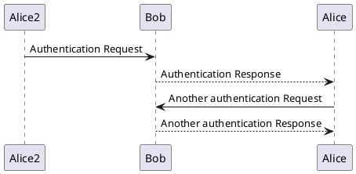

# test-plant

## How to run this manually

```shell
npx ts-node scripts/generate-puml.ts
```


```puml
@startuml
Alice2 -> Bob: Authentication Request
Bob --> Alice: Authentication Response

Alice -> Bob: Another authentication Request
Alice <-- Bob: Another authentication Response
@enduml
```