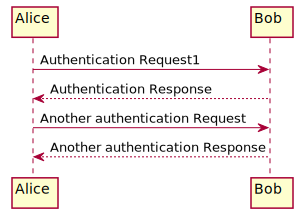
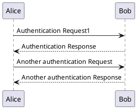

# test-plant

## How to run this manually

```shell
npx ts-node scripts/generate-puml.ts <glob-pattern>
```

<!-- puml:a98ef950f17ef0723a9dc39c2abb110fa7d2963b2402a943995a9229becfbe16 -->

<details>
<summary>source code</summary>


</details>

You can also use files with the puml-extension as an image like so:


