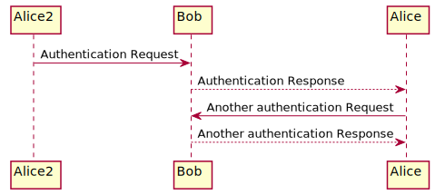
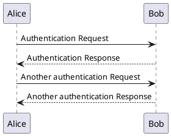

# test-plant

## How to run this manually

```shell
npx ts-node scripts/generate-puml.ts
```

<!-- puml:e44da9ae3c8b868ab84cc2a9f2e9598f185d9a29047a8576a068897874b4ce39 -->

<details>
<summary>source code</summary>


</details>