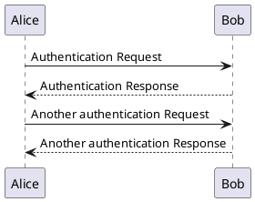

# test-plant

## How to run this manually

```shell
npx ts-node scripts/generate-puml.ts <glob-pattern>
```

<!-- puml:3d69686b72944c72dca07e8358d9d7544986d9aecc994f7e31707b6d8587324e -->

<details>
<summary>source code</summary>


</details>