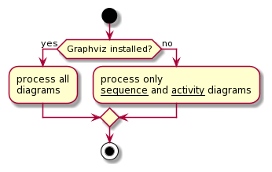
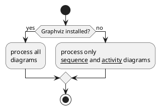

# This is just a test

Just a test to auto render PlantUML

<!-- puml:123 -->

    
PlantUML source

```puml
@startuml
start

if (Graphviz installed?) then (yes)
  :process all\ndiagrams;
else (no)
  :process only
  __sequence__ and __activity__ diagrams;
endif

stop
@enduml
```

<!-- puml:123 -->

test
test

With some stuff in between
