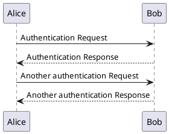
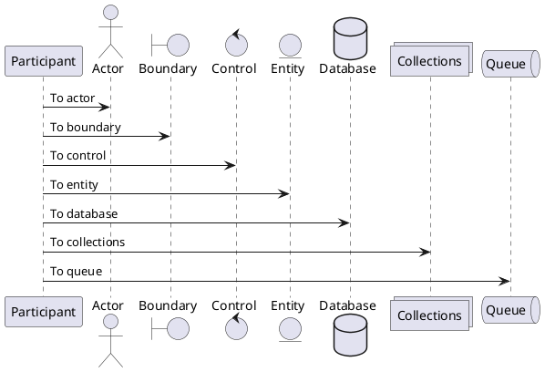

# Docs

This is just a simple demo on how to have plantUML rendered in a markdown file.

Just create a simple code block with the `puml` format and the `scripts/generate-puml.ts` takes care of the rest.

For example the following code block will result in an image:

    ```puml
    @startuml
    Alice -> Bob: Authentication Request
    Bob --> Alice: Authentication Response

    Alice -> Bob: Another authentication Request
    Alice <-- Bob: Another authentication Response
    @enduml
    ```

When running `npx ts-node scripts/generate-puml.ts` this is the output:



---

This means that even multiple diagrams can be rendered with no problem


