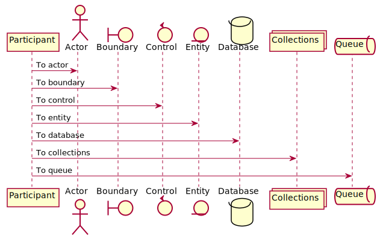

# Docs

This is just a simple demo on how to have plantUML rendered in a markdown file in GitHub Markdown files.

Just create a simple code block with the `puml` format and the `scripts/generate-puml.ts` takes care of the rest.

For example the following code block will result in an image:

    ```puml
    @startuml
    Alice -> Bob: Authentication Request
    Bob --> Alice: Authentication Response

    Alice -> Bob: Another authentication Request
    Alice <-- Bob: Another authentication Response
    @enduml
    ```

When running `npx ts-node scripts/generate-puml.ts` this is the output:

<!-- puml:3d69686b72944c72dca07e8358d9d7544986d9aecc994f7e31707b6d8587324e -->

<details>
<summary>source code</summary>


</details>

---

This means that even multiple diagrams can be rendered with no problem

<!-- puml:1eaa518b726cfca05f3c061a25caabb9c3c237a1ed32b3923d80d68b7b492407 -->

<details>
<summary>source code</summary>


</details>

---

As this is just a demo on how to create some documentation, [links to other pages](subpage.md) should not be missed here.
Even [nested subpages](nested/subpage.md) are no big deal for GitHub.
