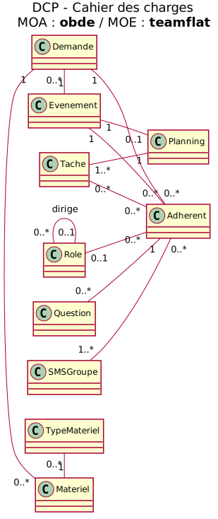
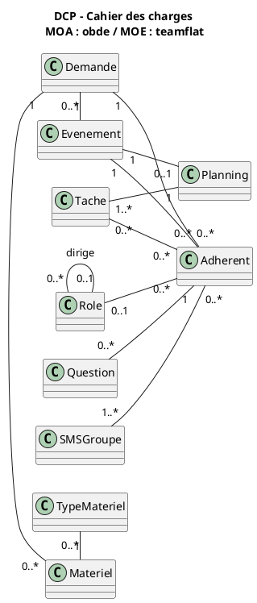

# Nested Subpage with PUML

<!-- puml:c4f03786e034da91d5893e789edbda23f49791bd4d8c23d8060e803fe56d333b -->

source code

```puml
@startuml
title DCP - Cahier des charges\n MOA : <b>obde</b> / MOE : <b>teamflat</b>
left to right direction
skinparam shadowing false

class "Role" as role
class "Adherent" as adherent
class "Materiel" as materiel
class "TypeMateriel" as type
class "Evenement" as evenement
class "Planning" as planning
class "Tache" as tache
class "Demande" as demande
class "Question" as question
class "SMSGroupe" as sms

evenement "1" -- "0..1" planning
evenement "1" -- "0..*" adherent
tache "1..*" -- "1" planning
tache "0..*" -- "0..*" adherent
role "0..1" -- "0..*" adherent
question "0..*" -- "1" adherent
sms "1..*" -- "0..*" adherent
role "0..*" -- "0..1" role : dirige
demande "0..*" - "1" evenement
adherent "0..*" - "1" demande
type "0..*" - "1" materiel
demande "1" - "0..*" materiel

@enduml
```

Diagram from [real-world-plantuml.com](https://real-world-plantuml.com/)
