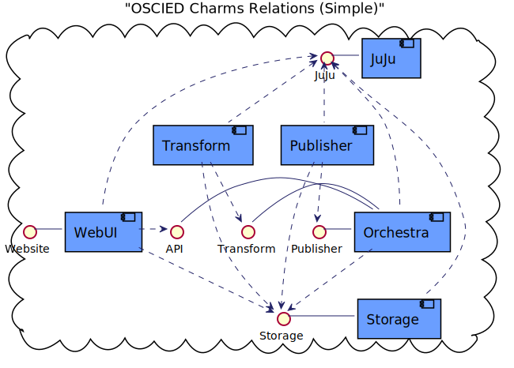
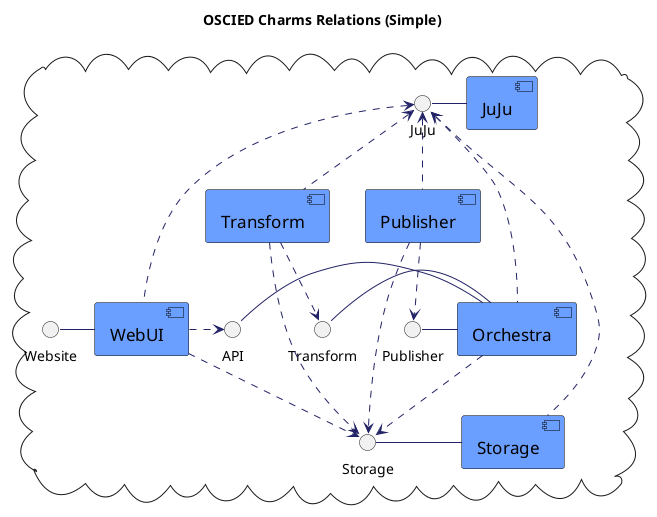

# Subpage

This is yet another demo page to be linked to.

This also contains a puml:

<!-- puml:b3921c9c2a1a158f946ffcf6e855c48d86b0256b6b57b385f5b4f7e61b63f797 -->

source code

Diagram from [real-world-plantuml.com](https://real-world-plantuml.com/)
